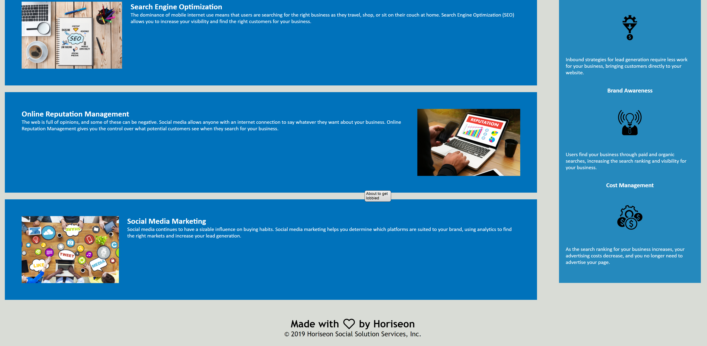

Horiseon Landing Page

About the project:
The goal of this page is to inform people of the benifits of using Horiseon. At the top of the page there is a header that links to the three main benifits of using horiseon.
The benifits section lays out the three main things that Horiseon will help you with. Those being Search Engine Optimization, Online Reputation Managment, and Social Media Marketing.
The aside section exlpains some of the other benifits such as Lead Generation, Brand Awareness, and Cost Managment.

Built Using:
HTML
CSS
This page was built with accessability as a main focus

Usage:
The only thing that the page needs is a web browser to open. 
Below is an example of what the webpage should look like when opened.

